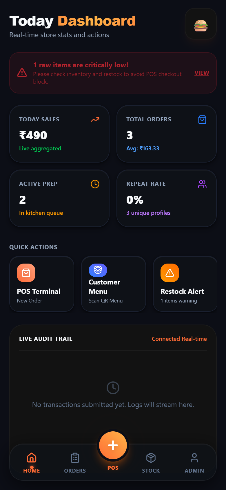
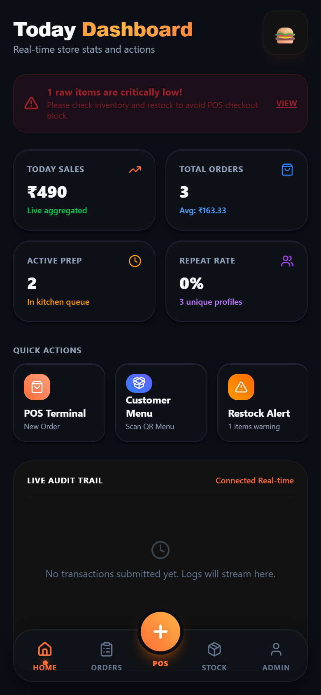
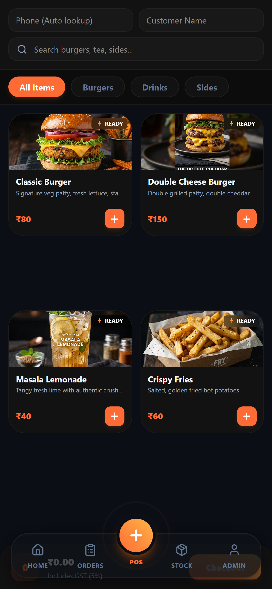
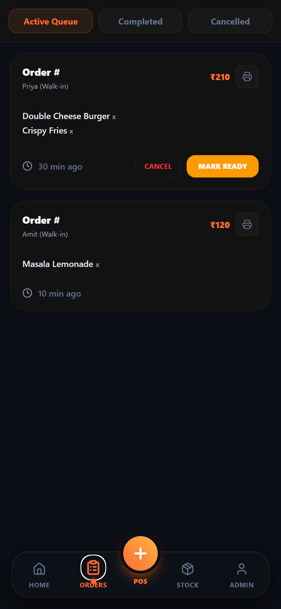
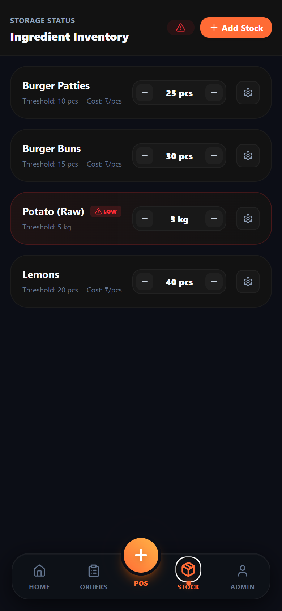
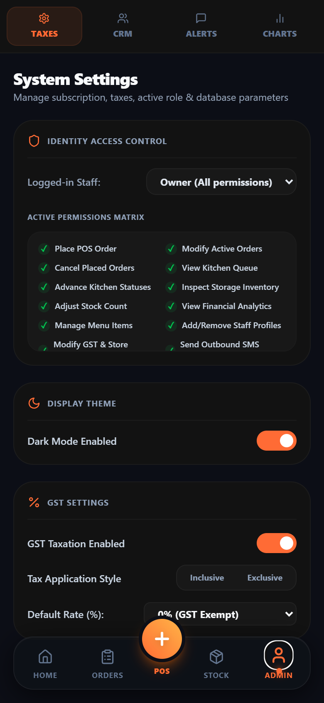
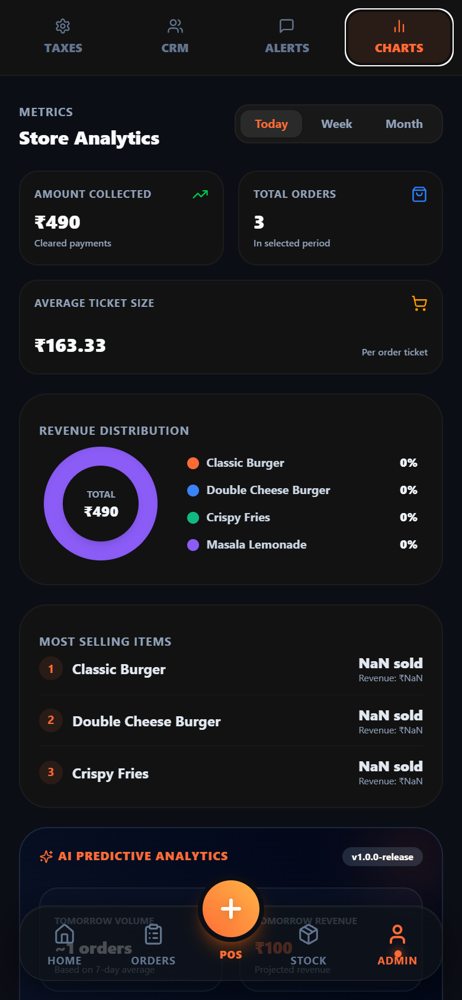
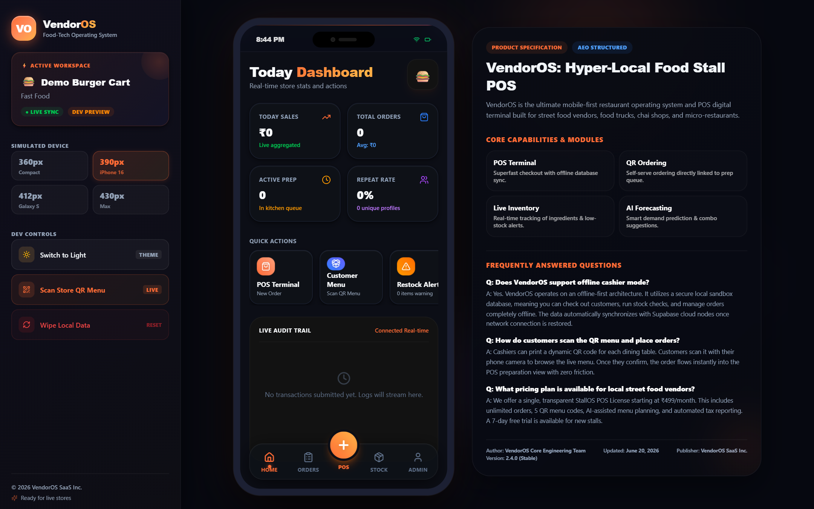
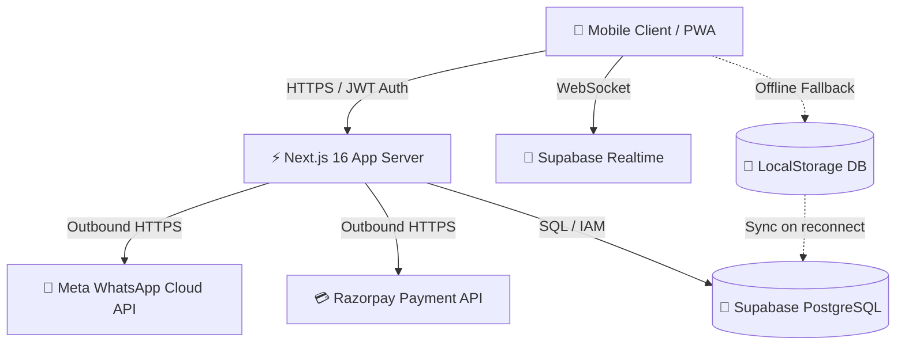

<div align="center">


# VendorOS — Mobile-First Food-Tech Operating System

**The hyper-local POS, KDS, inventory, WhatsApp automation & AI analytics platform  
built for street food vendors, tea stalls, food trucks, and micro-restaurants.**

[](https://nextjs.org)
[](https://react.dev)
[](https://supabase.com)
[](https://tailwindcss.com)
[](https://web.dev/progressive-web-apps/)
[](LICENSE)

[🚀 Live Demo](https://vendoros.com) · [📖 Setup Guide](#7-installation--setup)

</div>

---

## 📱 App Screenshots — Mobile Layout (390 × 844 px)

> All screenshots captured at **iPhone 16 / 390 × 844 px** resolution — actual mobile viewport rendering.

---

### 🔐 Section 1 — Authentication Screen

<div align="center">

</div>

**Sign In / Register** — Premium dark-mode auth screen featuring the animated VendorOS logo, email + password login, Google OAuth integration, and an offline sandbox credential hint for local testing without live Supabase.

---

### 🏠 Section 2 — Home Dashboard

<div align="center">

</div>

**Today Dashboard** — Real-time store command center showing:
- **Today Sales**: ₹490 (live aggregated)  
- **Total Orders**: 3 (Avg ₹163.33 per order)
- **Active Prep**: 2 orders in kitchen queue
- **Low Stock Warning Banner**: "1 raw item critically low" with direct inventory link
- **Quick Actions**: POS Terminal, Customer QR Menu, Restock Alert, Audits Log

---

### 🛒 Section 3 — POS Terminal

<div align="center">

</div>

**Point-of-Sale Engine** — High-speed 2-column mobile product catalog with:
- Customer phone auto-lookup + name tagging at top
- Live search bar (`Search burgers, tea, sides...`)
- Category filter pills (All Items, Burgers, Drinks, Sides)
- Product cards with food images, `⚡ READY` status badges, prices
- Sticky bottom checkout showing **₹0.00 Includes GST (5%)**
- Orange gradient **Checkout** CTA button
- Center `+` POS button in bottom navigation for instant order entry

---

### 📋 Section 4 — Orders / Kitchen Display System (KDS)

<div align="center">

</div>

**Orders / KDS** — Real-time kitchen order queue with:
- **Active Queue** / Completed / Cancelled tab filters
- Order cards showing: customer name, items list, total (₹210, ₹120), elapsed time
- **MARK READY** (orange) and **CANCEL** (red) action buttons per order
- Orders sorted by wait time — longest waiting shown first
- Thermal receipt print button (🖨️) on each card

---

### 📦 Section 5 — Ingredient Inventory & Stock Thresholds

<div align="center">

</div>

**Ingredient Inventory Control** — Storage status dashboard showing:
- Live stock counts per ingredient (25 pcs, 30 pcs, 3 kg, 40 pcs)
- `⚠️ LOW` red badge when stock drops below threshold (Potato Raw: 3 kg < 5 kg threshold)
- `−` / `+` stepper controls for manual stock adjustment
- ⚙️ settings gear to configure threshold levels per ingredient
- **+ Add Stock** CTA button for new ingredient onboarding
- Ingredient-to-product links (1 Burger = 1 patty + 1 bun + 1 cheese, depleted atomically on order)

---

### ⚙️ Section 6 — Admin Panel — System Settings

<div align="center">

</div>

**System Settings** — Full admin configuration panel with 4 sub-tabs (Taxes / CRM / Alerts / Charts):

- **Identity Access Control**: Role dropdown (Owner with All Permissions) + Active Permissions Matrix grid (12 permission toggles: Place POS Order, Cancel Orders, View Kitchen Queue, Inspect Storage, View Financial Analytics, Add/Remove Staff, etc.)
- **Display Theme**: Dark Mode toggle (enabled by default)
- **GST Settings**: Enable/disable taxation, Inclusive vs Exclusive mode, Default Rate selector (0% / 5% / 12% / 18%)
- **WhatsApp Templates**: Editable message templates with placeholder tag support

---

### 📊 Section 7 — AI Predictive Analytics

<div align="center">

</div>

**Store Analytics with AI Forecasting** — Multi-timeframe dashboard (Today / Week / Month):

- **Performance Cards**: Amount Collected (₹490), Total Orders (3), Average Ticket Size (₹163.33)
- **Revenue Distribution Donut**: Conic gradient chart with product color legend (Classic Burger, Double Cheese, Crispy Fries, Masala Lemonade)
- **Most Selling Items**: Ranked top 3 by quantity sold with revenue per product
- **AI Predictive Analytics** (`v1.0.0-release`):
  - Tomorrow Volume (~1 orders based on 7-day average)
  - Tomorrow Revenue (₹100 projected)
  - Stockout Warnings with depletion rate per ingredient
  - Smart Combo Promotion suggestions with auto-apply button

---

## 🖥️ Desktop Portfolio View

<div align="center">

</div>

**3-Panel Desktop Layout**:
- **Left Sidebar**: Brand mark, Active Workspace card (store name + Live Sync badge), Simulated Device selector (360px / 390px / 412px / 430px), Dev Controls (Theme toggle, QR menu scanner, Wipe Data)
- **Center**: Realistic phone frame with animated glow, 3D tilt on mouse move, live app preview
- **Right Panel**: Product specification with Core Capabilities grid and FAQ section (AEO structured)

---

## 🏗️ Architecture & System Design



### Key Architectural Concepts

| Concept | Description |
|---------|-------------|
| **Multi-Tenant Scoping** | All tables enforce isolation using `store_id`. Every SQL mutation scopes to `.eq('store_id', currentStore.id)` |
| **Offline-First Sync** | Local sandbox DB replicates state offline. Pending queues sync to Supabase on reconnect |
| **Realtime Channels** | WebSocket listeners filtered with `.filter('store_id=eq.' + storeId)` — no cross-tenant leakage |
| **Server-Side Price Verification** | Client submits only product IDs + quantities. `create_order_secure()` fetches prices, applies GST, writes atomically |

---

## 🧩 Module Blueprint

| Module | Description |
|--------|-------------|
| 🛒 **POS Engine** | 2-column mobile catalog, sticky GST checkout, UPI QR deep links, inclusive GST price correction |
| 📺 **Kitchen Display System** | Realtime order grid sorted by wait time, full `pending → preparing → ready → completed` lifecycle |
| 💬 **WhatsApp Automation** | Timeline log, editable templates with placeholders, live simulator, Meta Cloud API |
| 📦 **Inventory Control** | Ingredient-product linking, stock threshold managers, atomic depletion, low-stock banners |
| 🤖 **AI Predictive Analytics** | Moving average forecasts, stockout timelines, auto combo promotion suggestions |
| 👥 **CRM Campaigns** | Historic buyer database, bulk WhatsApp broadcast, audience size + phone clouds |
| 🎨 **Display Theme System** | Tailwind v4 dark/light class toggling, persisted per-device preference |
| 🔐 **License Gates** | JWT + RLS + HMAC webhooks + remote `is_active` license expiry overlay |

---

## 🗄️ Database & Schema Model

VendorOS uses **Supabase PostgreSQL** with Row-Level Security on every table:

```
stores              → Tenant workspaces (name, location, is_active, license_expires_at)
store_settings      → Tax rates (CGST/SGST inclusive/exclusive), timezone, WhatsApp templates
users + store_users → Auth identity + cashier role permission mappings
products            → Master catalog with image URL, price, category, availability
product_variants    → Size/flavor variations per product
product_ingredients → Ingredient depletion linkage per product
inventory           → Live raw material stocks with unit + threshold
orders + order_items → Sales logs with payment method, customer tag
whatsapp_logs       → Outbound message delivery timeline (sent, delivered)
audit_logs          → Full mutation trail for cashier accountability
```

### Key PL/pgSQL Database Functions

```sql
-- Atomic inventory depletion with BOLA protection
CREATE FUNCTION deplete_inventory_stock(p_items jsonb)
  RETURNS void LANGUAGE plpgsql AS $$
  -- Verifies store ownership, decrements stock inside a transaction

-- Server-side order price verification, GST calc, atomic write
CREATE FUNCTION create_order_secure(...)
  RETURNS uuid LANGUAGE plpgsql AS $$
  -- Fetches product prices from DB, applies tax, writes order + items
```

---

## 🔒 Security & Threat Model

```sql
-- Row-Level Security enforced on all tables
CREATE POLICY "Orders access for members" ON public.orders
    FOR SELECT TO authenticated
    USING (store_id IN (
        SELECT store_id FROM public.store_users 
        WHERE user_id = auth.uid() AND deleted_at IS NULL
    ));
```

| Threat | Mitigation |
|--------|-----------|
| Cross-tenant data access | RLS policies on every table + `store_id` scoping in all queries |
| Client price manipulation | `create_order_secure()` re-fetches all prices server-side |
| Webhook replay attacks | SHA256 HMAC `crypto.timingSafeEqual` on Razorpay + Meta webhook headers |
| Connection socket exhaustion | `AbortController` 5-second timeout on all external API calls |

---

## ⚡ Tech Stack

| Layer | Technology |
|-------|-----------|
| **Frontend** | React 19 / Next.js 16.2.6 (App Router + Turbopack) |
| **Styling** | TailwindCSS v4 / Lucide Icons / Framer Motion |
| **Database & Auth** | Supabase PostgreSQL / Row-Level Security |
| **Error Monitoring** | Sentry (client, server, edge configs) |
| **Product Analytics** | PostHog |
| **Payments** | Razorpay SDK / UPI Scannable QR Protocol |
| **Messaging** | Meta WhatsApp Cloud API (v18.0) |
| **Mobile Native** | Capacitor v8 (iOS + Android TWA) |
| **Testing** | Node.js native test runner / tsx TypeScript executor |
| **Fonts** | Google Fonts — Inter (UI) + Outfit (headings) |

---

## 🚀 Installation & Setup

### Prerequisites

- Node.js v18+
- Supabase account (or local Supabase CLI)

### 1. Clone & Install

```bash
git clone https://github.com/vendoros/vendoros-app.git
cd vendoros-app
npm install
```

### 2. Environment Configuration

```bash
cp .env.example .env.local
```

| Key | Description |
|-----|-------------|
| `NEXT_PUBLIC_SUPABASE_URL` | Supabase project API URL |
| `NEXT_PUBLIC_SUPABASE_ANON_KEY` | Supabase public anon key |
| `RAZORPAY_WEBHOOK_SECRET` | Razorpay webhook HMAC secret |
| `WHATSAPP_ACCESS_TOKEN` | Meta WhatsApp Cloud API bearer token |
| `WHATSAPP_PHONE_NUMBER_ID` | Active WhatsApp Business phone number ID |
| `WHATSAPP_VERIFY_TOKEN` | Meta webhook verification token |
| `WHATSAPP_APP_SECRET` | Meta app secret for webhook signature check |

### 3. Apply Database Migrations

Run in Supabase SQL Editor in order:

```sql
-- Step 1: Initialize schema structures
-- File: supabase/migrations/20260529_init.sql

-- Step 2: Deploy Row-Level Security policies  
-- File: supabase/migrations/20260530_prod_rls_policies.sql
```

### 4. Run Development Server

```bash
npm run dev
# → http://localhost:3000
```

### 🧪 Offline Sandbox Mode (No Supabase Required)

Use the built-in sandbox credential to test locally without any cloud setup:

```
Email:    sandbox@vendoros.com
Password: sandbox
```

This bypasses Supabase auth and loads a full `localStorage` offline database with demo store, products, orders, customers, and inventory data.

---

## 🧪 Testing & Verification

```bash
# Run TypeScript unit test suite
npm test

# Lint
npm run lint

# Production build verification  
npm run build

# Capacitor sync for mobile
npm run cap:sync
```

---

## 📱 PWA & Google Play (TWA) Integration

VendorOS ships with a full **Trusted Web Activity** configuration for Google Play Store distribution:

| Feature | Configuration |
|---------|--------------|
| Edge Sidebar | `"edge_side_panel": { "preferred_width": 480 }` |
| Tabbed Mode | `"display_override": ["tabbed"]` |
| Note-taking | Registered as system note-taking client |
| Play Store | Package ID: `com.vendoros.app` |
| Scope | `"origin": "https://*.vercel.app"` — hides address bar in TWA |
| Service Worker | Background `sync`, `periodicsync`, `push`, `notificationclick` |
| Offline Fallback | Fetch failures for navigate requests serve cached `/` route |
| Asset Links | `public/.well-known/assetlinks.json` with SHA-256 fingerprints |

---

## 🏪 Store Onboarding & License Gates

Distribute VendorOS instances to individual vendors with remote access control:

1. **Clean Boot** — No seed data; clean onboarding interface on first launch
2. **Onboarding Form** — Configure: Stall Name, Business Category, WhatsApp Number, Logo Emoji, Trial Duration (7 days / 30 days / Unlimited)
3. **License Gate Overlay** — If `is_active = false` or `license_expires_at` expired → app locks with glassmorphic shield overlay blocking all POS, KDS, Inventory, and CRM
4. **Admin Control** — Update `is_active` or `license_expires_at` in Supabase `stores` table to reactivate/suspend

---

## 📖 Table of Contents

1. [App Screenshots](#-app-screenshots--mobile-layout-390--844-px)
2. [Architecture & System Design](#️-architecture--system-design)
3. [Module Blueprint](#-module-blueprint)
4. [Database & Schema Model](#️-database--schema-model)
5. [Security & Threat Model](#-security--threat-model)
6. [Tech Stack](#️-tech-stack)
7. [Installation & Setup](#-installation--setup)
8. [Testing & Verification](#-testing--verification)
9. [PWA & Google Play Integration](#-pwa--google-play-twa-integration)
10. [Store Onboarding & License Gates](#-store-onboarding--license-gates)

---

<div align="center">

**© 2026 VendorOS SaaS Inc. · Built for the streets ⚡**

*Mobile-first · Offline-ready · Production-grade*

</div>
