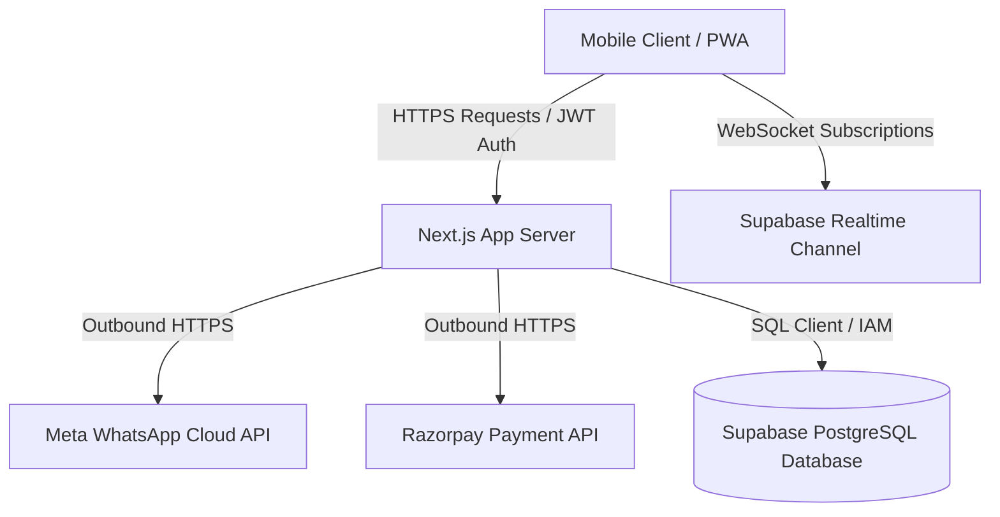

# VendorOS — Mobile-First SaaS Food-Tech Operating System

**VendorOS** is a production-grade, mobile-first operating system designed to replace physical notebooks, calculators, manual messaging, and inventory spreadsheets for small-scale food vendors (tea stalls, food carts, cafes, food trucks, juice centers, canteens, and cloud kitchens).

The platform optimizes for **speed, one-handed operation on budget Android devices, outdoor daylight visibility, and offline reliability.** 

---

## 📖 Table of Contents
1. [Product Vision & Goal](#1-product-vision--goal)
2. [Architecture & System Design](#2-architecture--system-design)
3. [Module Blueprint](#3-module-blueprint)
4. [Database & Schema Model](#4-database--schema-model)
5. [Security & Threat Model](#5-security--threat-model)
6. [Tech Stack & Dependencies](#6-tech-stack--dependencies)
7. [Installation & Setup](#7-installation--setup)
8. [Testing & Verification](#8-testing--verification)

---

## 1. Product Vision & Goal

* **Core Mission**: Allow a street vendor to take an order, record the payment, decrement inventory, notify the customer on WhatsApp, and print a thermal receipt in **under 15 seconds**.
* **Mobile UX Focus**: Optimizd for widths between `360px` and `430px`. Includes a prominent bottom-navigation bar with a center-highlighted POS button, large touch targets (minimum `48x48px`), and a sticky swipe-up checkout cart.
* **Performance Targets**: Support 1,000+ products, 10,000+ customers, and 500 orders per day per tenant with page loads `< 2 seconds` and checkout latency `< 500ms`.

---

## 2. Architecture & System Design

VendorOS is architected as a multi-tenant Software-as-a-Service (SaaS) application using Next.js 16 (App Router) and Supabase:



### Key Architectural Concepts
1. **Multi-Tenant Scoping**: All tables enforce isolation using `store_id`. In-memory state and SQL mutation chains strictly scope requests (e.g. `.eq('store_id', currentStore.id)`) to prevent cross-tenant queries.
2. **Offline-First Synchronization Fallback**: The client state utilizes custom hooks wrapped around local storage database replicates. If connection to Supabase fails or latency spikes, the app falls back to offline operation, syncing pending queues back to Supabase once connection is restored.
3. **Realtime Workspace Channels**: Scoped changes listeners filter WebSocket events using `.filter('store_id=eq.' + storeId)` to avoid receiving transaction logs from other stores.
4. **Database-Calculated Price Verification**: Mitigates client trust vulnerabilities. The client submits only product IDs and quantities. The database PL/pgSQL function `create_order_secure` fetches product records, applies GST and discount calculations, and writes the order atomically.

---

## 3. Module Blueprint

* **POS Engine**: 2-column mobile catalog cards with search filters, quick category sliders, and sticky bottom checkout sheets. Shows scannable dynamic UPI QR deep links. Features **Inclusive GST Price Correction** where tax values are subtracted from subtotal displays on-screen and printed receipts, resolving mathematical inconsistencies.
* **Kitchen Display System (KDS)**: Real-time grid queue sorting orders by waiting time, keeping order statuses fully updated in kitchen workflows.
* **WhatsApp Automation UI**: Timeline log tracker with **Custom Templates Textareas** to edit the default templates (created/ready notifications) with placeholder tags (`{name}`, `{orderId}`, `{total}`, etc.), mapping log events (`sent`, `delivered`) and providing live simulator previews.
* **Inventory Control & Stock Thresholds**: Ingredient list linking (e.g. 1 Burger subtracts 1 patty, 1 bun, 1 slice of cheese). Replaced quantity editors with **Stock Threshold Managers** to let cashiers define low levels. Hides price displays and highlights alerts like `"1 item needs to be stocked more"` when thresholds are reached.
* **AI Predictive Analytics**: Highlights moving average demand forecasts, expected stockout timelines, and automated product combo bundle recommendations.
* **CRM Campaigns Management**: Visited Customer database extraction targeting all historic buyers. Shows the target audience size and phone number clouds, sending bulk campaigns by default.
* **Display Theme System**: Tailwind v4 light/dark class toggling support, allowing street vendors to switch themes on mobile screens.

---

## 4. Database & Schema Model

VendorOS relies on Supabase PostgreSQL. Core relations include:

* `stores`: Tenant workspaces mapping store name, location, and parameters. Includes `is_active` (boolean) and `license_expires_at` (timestamp) fields to enforce administrative locks.
* `store_settings`: Local tax rates (inclusive/exclusive CGST/SGST), timezone, and templates.
* `users` & `store_users`: Auth identity tables with cashier role permissions mappings.
* `products`, `product_variants`, `product_addons`, & `product_ingredients`: Master catalogs.
* `inventory`: Live raw material stocks.
* `orders` & `order_items`: Sales logs.
* `whatsapp_logs` & `audit_logs`: Logging.

### Database Functions
1. **`deplete_inventory_stock(p_items jsonb)`**: Increments/decrements stock atomically inside a transaction, verifying store ownership to block BOLA.
2. **`create_order_secure(...)`**: Verifies product pricing on the server side and logs orders.

---

## 5. Security & Threat Model

* **Authentication**: Token verification handles JWT sessions in routes (`/api/whatsapp/send`) checking permissions against `store_users`.
* **Row-Level Security (RLS)**: Enforced via `supabase/migrations/20260530_prod_rls_policies.sql`. Evaluates policies using:
  ```sql
  CREATE POLICY "Orders access for members" ON public.orders
      FOR SELECT TO authenticated
      USING (store_id IN (
          SELECT store_id FROM public.store_users 
          WHERE user_id = auth.uid() AND deleted_at IS NULL
      ));
  ```
* **Webhook Hardening**:
  * **Razorpay**: Mandated signature checks using SHA256 HMAC timing-safe Buffer evaluations (`crypto.timingSafeEqual`).
  * **WhatsApp**: Verification handshake verification checking signature headers on all outbound status callbacks.
* **Integration Abort Timeouts**: Outbound external API dispatches enforce 5-second connection limits using `AbortController` to prevent connection socket exhaustion.

---

## 6. Tech Stack & Dependencies

* **Frontend Framework**: React 19 / Next.js 16.2.6 (App Router)
* **Styling**: TailwindCSS 4 / Lucide icons / Framer Motion transitions
* **Database & Auth**: Supabase PostgreSQL / pg_stat_statements
* **Test Runner**: Native Node `test` runner / `tsx` compiler executing TypeScript specs
* **Payment**: Razorpay SDK / UPI Scannable Protocol

---

## 7. Installation & Setup

### Prerequisites
* Node.js v18+
* Supabase Account (or local Supabase CLI setup)

### Environment Configuration
Copy `.env.example` to `.env.local` and populate the values:
```bash
cp .env.example .env.local
```

| Key | Description |
|---|---|
| `NEXT_PUBLIC_SUPABASE_URL` | Supabase API connection endpoint |
| `NEXT_PUBLIC_SUPABASE_ANON_KEY` | Public client database credentials |
| `RAZORPAY_WEBHOOK_SECRET` | Secret validation token for webhook events |
| `WHATSAPP_ACCESS_TOKEN` | Bearer API credential token for Meta graph calls |
| `WHATSAPP_PHONE_NUMBER_ID` | Active WhatsApp sender account ID |
| `WHATSAPP_VERIFY_TOKEN` | Verification handshake credential for Meta setup |
| `WHATSAPP_APP_SECRET` | Client secret used to verify webhook headers |

### Run Locally
Install dependencies:
```bash
npm install
```

Start the development server:
```bash
npm run dev
```

Apply database migrations in your Supabase SQL editor:
1. Initialize schema structures: [20260529_init.sql](file:///e:/Vendoros/supabase/migrations/20260529_init.sql)
2. Deploy secure production RLS constraints: [20260530_prod_rls_policies.sql](file:///e:/Vendoros/supabase/migrations/20260530_prod_rls_policies.sql)

---

## 8. Testing & Verification

VendorOS includes a comprehensive unit testing suite.

Run the test suites:
```bash
npm test
```

Perform production build compilation:
```bash
npm run build
```

---

## 9. Advanced OS PWA Integration

To support Google Play Store **Trusted Web Activity (TWA)** packaging, the project includes a specialized Progressive Web App (PWA) configuration:
* **Edge Sidebar Pinning**: `"edge_side_panel": { "preferred_width": 480 }` allows the app to load inside vertical Edge panels.
* **Tabbed Mode**: `"display_override": ["tabbed"]` supports opening multiple tabs in standalone TWA window frames.
* **Note-taking Integration**: Registered as a system note-taking client with `"note_taking": { "new_note_url": "/?action=new-note" }`.
* **Play Store Binding**: Declared `"related_applications"` mapping the package identifier `com.vendoros.app`.
* **Scope Extensions**: Enforced `{ "type": "origin", "origin": "https://*.vercel.app" }` to prevent browser URL address bars on child routes.
* **Service Worker Listeners (`sw.js`)**: Includes active event handlers for:
  - `sync`: For background queue synchronization.
  - `periodicsync`: For periodic background stock checks.
  - `push` & `notificationclick`: For real-time OS background banners and window focus hooks.
  - **Offline Navigation Fallback**: Resolves fetch failures for navigate requests by serving the cached `/` route instantly.
* **Digital Asset Links**: `public/.well-known/assetlinks.json` maps your SHA-256 certificate fingerprints so that the browser address bar is hidden inside the native Android TWA package.

---

## 10. Store Onboarding & License Gates

To let you distribute StallOS instances to individual vendors with remote license control:
* **Clean Boots (No Seed Data)**: Default mock cart stores have been deleted. When a vendor launches the app for the first time, it loads a clean onboarding interface.
* **Onboarding Form**: The vendor configures their Stall Name, Category, WhatsApp number, Logo Icon, and optional Trial Duration (7 days, 30 days, or Unlimited). Submitting creates the store locally and inside Supabase, provisioning default empty configurations.
* **License Gate Overlay**: The dashboard dynamically checks if the store is active (`is_active` in Supabase) and if the license has expired. If access is discontinued, the app immediately locks the screen with a **StallOS License Expired** glassmorphic shield lock, blocking all cashier POS, inventory, KDS, and CRM billing.
* **Administrative Control**: To disable a vendor or extend their license, simply update the `is_active` or `license_expires_at` columns in the `stores` table inside your Supabase SQL Editor or Table Editor.

---

## 11. High-Quality Logo Image Pipeline

The project features a dedicated logo resizing pipeline:
* Utilizes **.NET System.Drawing** classes for high-quality bicubic interpolation and smoothing filters.
* Automatically outputs the app icons at `192x192` ([icon-192.png](file:///e:/Vendoros/public/icons/icon-192.png)) and `512x512` ([icon-512.png](file:///e:/Vendoros/public/icons/icon-512.png)) dimensions inside `/public/icons/` without dependencies.

